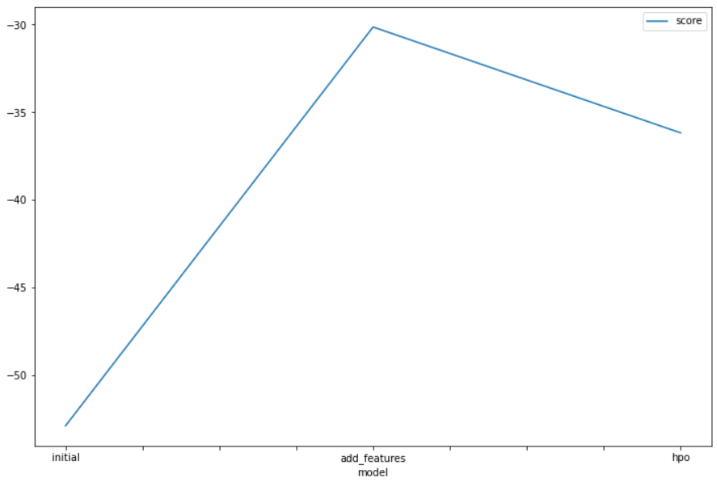
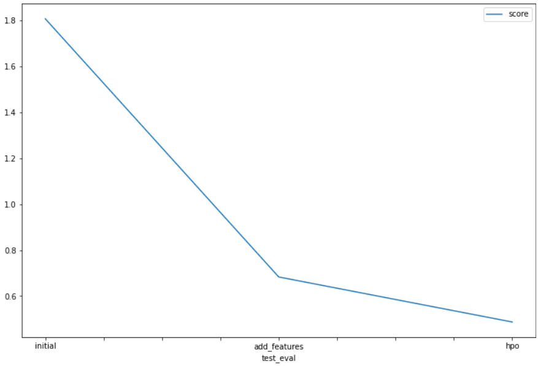

# Report: Predict Bike Sharing Demand with AutoGluon Solution
#### Rahul Chauhan

## Initial Training
### What did you realize when you tried to submit your predictions? What changes were needed to the output of the predictor to submit your results?
Data contained negative values. I had trouble doing the project on my local environment so I decided to do everything in the SageMaker studio. and managed to improve my results and get a score of below 0.5 while in the beginning I got a score of more than 1.8

### What was the top ranked model that performed?
TODO: Weighted_Ensemble_L3 model was my top ranked which I achieved by completing the third run with more features and tuning of hyperparameters.

## Exploratory data analysis and feature creation
### What did the exploratory analysis find and how did you add additional features?
After analyzing the distributions, I discovered that the temperature categories followed a normal distribution pattern. For the extra features I divided the datetime in month, day, year and hour, which resulted in significant improvement. Also it was usefull to transform the season and weather features to categorical.

### How much better did your model preform after adding additional features and why do you think that is?
The best model's rmse decreased from 52.875794 to 30.132884 as a validation score which is a huge improvement also the test error decreased from 1.80744 to 0.68322 which is also a huge improvement in performance.
The reason behind this improvement could be attributed to the hour feature, as it provides the trained models with valuable insights and intuition regarding the general fluctuations in bike share demand throughout different times of the day. By focusing on the hour feature rather than specific dates, months, or years, the models can better discern patterns related to increased or decreased demand. Analyzing the histogram of the hour feature suggests that the data was evenly recorded across all hours of the day, indicating that this feature holds meaningful information for prediction

## Hyper parameter tuning
### How much better did your model preform after trying different hyper parameters?
The model performed much better than the initial model and with just the features. The model's training rmse increased from 30.132884 to 36.168471 for the best model. However, the model's test error decreased from 0.68322 to 0.48718

### If you were given more time with this dataset, where do you think you would spend more time?
I will spend more time tuning the model with different combinations of hyperparameter options and values

### Create a table with the models you ran, the hyperparameters modified, and the kaggle score.
|model|hpo1|hpo2|hpo3|score|
|--|--|--|--|--|
|initial|default|default|default|1.80744|
|add_features|default|default|default|0.68322|
|hpo|GBM: num_leaves: lower=26, upper=66|NN: dropout_prob: 0.0, 0.5|GBM: num_boost_round: 100|0.48718|

### Create a line plot showing the top model score for the three (or more) training runs during the project.

### Create a line plot showing the top kaggle score for the three (or more) prediction submissions during the project.

## Summary
In summary, I think that project showed how important both feature engineering and hyper parameter optimization are to the machine learning workflow. I was able to apply all the concepts that were covered in this unit of the course, by using those skilla I was able to develop a machine learning regression model by using the autogluon framework
